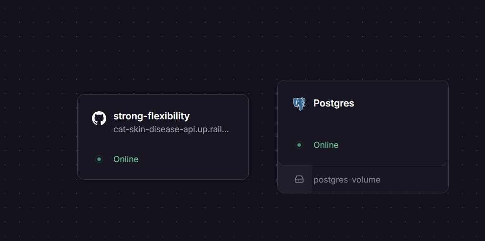
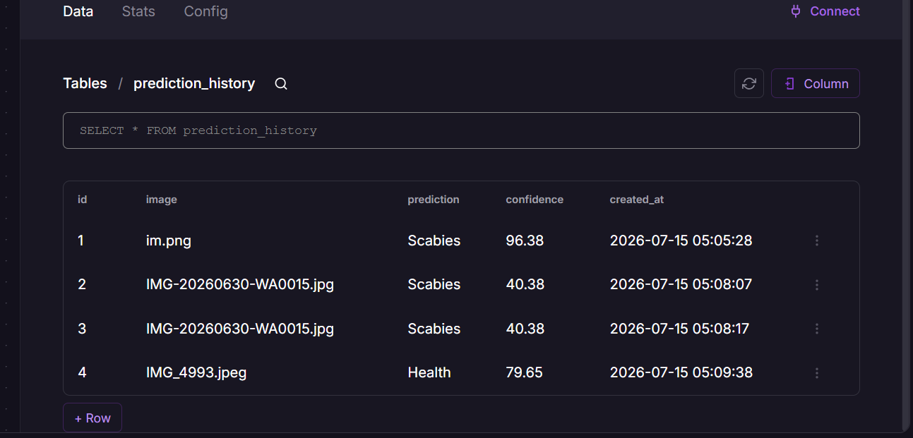
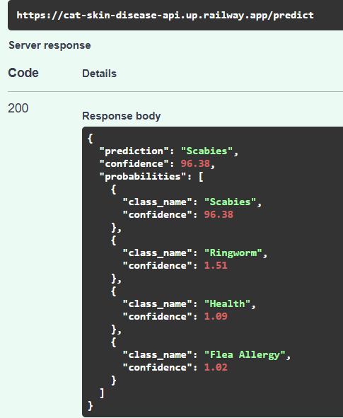

# 🐱 Cat Skin Disease API


REST API untuk mendeteksi penyakit kulit pada kucing menggunakan model **EfficientNetB0** yang dibangun dengan **FastAPI**. API ini menerima gambar kucing, melakukan prediksi menggunakan model TensorFlow, menyimpan hasil prediksi ke PostgreSQL, dan mengembalikan hasil dalam format JSON.

---

## Features

- Image classification using EfficientNetB0
- FastAPI REST API
- TensorFlow / Keras inference
- PostgreSQL database
- Prediction history
- Swagger API Documentation
- Railway deployment

---

## API Endpoints

1. **GET /** - Health Check
2. **POST /predict** - Predict Cat Skin Disease
3. **GET /history** - Get Prediction History

---

## Disease Classes

Model dapat mengklasifikasikan 4 kelas:

- Health
- Flea Allergy
- Ringworm
- Scabies

---

## Tech Stack

- FastAPI
- TensorFlow
- Keras
- SQLAlchemy
- PostgreSQL
- Railway
- Uvicorn

---

## API Documentation

Swagger UI

```
https://cat-skin-disease-api.up.railway.app/docs
```

OpenAPI

```
https://cat-skin-disease-api.up.railway.app/openapi.json
```

---

## Live API

Base URL

```
https://cat-skin-disease-api.up.railway.app
```

---

## Deployment

The API is deployed on Railway.

Deployment includes:

- FastAPI Application
- TensorFlow Model (.keras)
- PostgreSQL Database

---

## Dokumentasi

### Railway



### Railway Postgree



### Hasil prediksi



---
